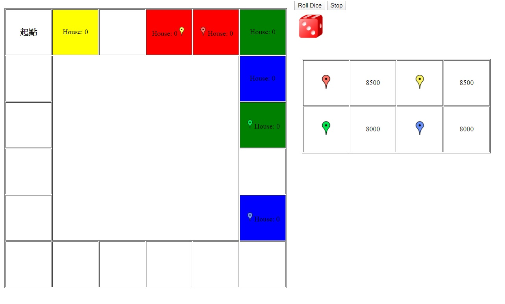

## 大富翁


# Results (Screenshots)




## html code
```html   
   
   <html>
   <head>
      <meta charset = "utf-8">
      <title>大富翁</title> 
	  <link rel="stylesheet" href="s1061444_HW3.css">
      <style></style>       
      <script src = "s1061444_HW3.js"></script>
   </head>
   <body>
 
<!--大富翁格子-->
      <table border="1" class="t2">
	<tr>
		<td id="td0"></td>
		<td id="td1"></td>
		<td id="td2"></td>
		<td id="td3"></td>
		<td id="td4"></td>
		<td id="td5"></td>
	  </tr>
	  <tr>
		<td id="td19"></td>
		<td rowspan="4" colspan="4" ></td>
		<td id="td6"></td>
	  </tr>
	  <tr>
		<td id="td18"></td>
		<td id="td7"></td>
	  </tr>
	  <tr>
		<td id="td17"></td>
		<td id="td8"></td>
	  </tr>
	  <tr>
		<td id="td16"></td>
		<td id="td9"></td>
	  </tr>
	  <tr>
		<td id="td15"></td>
		<td id="td14"></td>
		<td id="td13"></td>
		<td id="td12"></td>
		<td id="td11"></td>
		<td id="td10"></td>
	  </tr>
	  </table>
<!--大富翁骰子按鈕-->
	  <form action = "#">
         <input id = "rollButton" type = "button" 
            value = "Roll Dice">
		 <input id = "rollButton2" type = "button" 
            value = "Stop">
      </form>
      </li>
	  
	  <form id="question" action = "#"></form>
<!--玩家&錢--> 
      <p>
	  <table border="1" class="t1">
	  <tr>
	  <td></td>
	  <td id="red">10000</td>
	  <td>
	  <td id="yellow">10000</td>
	  </tr>
	  <tr>
	  <td>
	  <td id="green">10000</td>
	  <td>
	  <td id="blue">10000</td>
	  </tr>
	  </table>
	  </p>
   </body>
</html>
   
```

## css code
```html  
.table1 {
	width:100px; height:100px;
	
}
.table2	{
	width:100px; height:500px;
}

td{
	width:100px; height:100px;
	
}
table{
	margin:1%;
	float:left;
	text-align:center;
}
.picture{
	width:20px; height:20px;
}

.die{
	margin:10px;
}
div{
	width:300px; height:500px;
	overflow:hidden;
	border:1px solid black;
}

```


## js code

```html  
var die1Image;
var dieValue;
var turn=0;
var gamestart='<h3>起點</h3>';
var now=new Array(0,0,0,0);
var picture=new Array(4);
picture[0]='';
picture[1]='';
picture[2]='';
picture[3]='';
var house = new Array(20);
var word="House: ";
var tdowner=new Array(20);
var tablechange1;
var tablechange2;
var x=document.tables;

var interval = null;
    function start()
    {
		var begin="";
		tablechange1 = document.getElementById( "td0" );

        begin= gamestart+picture[0]+picture[1]+picture[2]+picture[3];
		tablechange1.innerHTML = begin;
		
		var button = document.getElementById( "rollButton" );
        button.addEventListener( "click", rollDice, false );
		
		var button2 = document.getElementById( "rollButton2" );
        button2.addEventListener( "click", stop, false );
        dieImage = document.getElementById( "die1" );	
    } // end function start 
    function rollDice()
    {
        if ( interval )
		{	
			return;
		}
		turn++;
		if(turn==20)
		{
			turn=0;
		}
		interval = window.setInterval( "setImage( dieImage );", 10 );
    } // end function rollDice 
	function stop()
    {
		window.clearInterval( interval );
		interval = null;
		sat1(dieValue);		
	}
	function setImage(dieImg)
    {		
        dieValue=Math.floor( 1 + Math.random() * 6 );
		dieImg.setAttribute( "src", "die" + dieValue + ".png" );
        dieImg.setAttribute( "alt", "die image with " + dieValue + " spot(s)" );
	} // end function setImage
    function sat1(dieValue)
	{
		if( turn%4==1 )
		{
			sat2(picture[0],now[0],picture[1],picture[2],picture[3],now[1],now[2],now[3],dieValue) ;
			now[0]+=dieValue;	
		}
		else if(turn%4==2)
		{
			sat2(picture[1],now[1],picture[0],picture[2],picture[3],now[0],now[2],now[3],dieValue) ;
			now[1]+=dieValue;
		}
		else if(turn%4==3)
		{
			sat2(picture[2],now[2],picture[0],picture[1],picture[3],now[0],now[1],now[3],dieValue) ;
			now[2]+=dieValue;
		}
		else if(turn%4==0)
		{
			sat2(picture[3],now[3],picture[0],picture[1],picture[2],now[0],now[1],now[2],dieValue) ;
			now[3]+=dieValue;
		}
		check();
	}
	function sat2(picture,now,other1,other2,other3,othernow1,othernow2,othernow3,dieValue)
	{		 
		var tablechange11= document.getElementById( "td"+now );
		var old='';
		if(now==0)
		{
			old+=gamestart;
		}
		if(othernow1==now)
		{
			old+=other1;
		}
		if(othernow2==now)
		{
			old+=other2; 
		}
		if(othernow3==now)
		{
			old+=other3;
		}
		//window.alert(tablechange11.style.backgroundColor);
		if(now!=0 && tablechange11.style.backgroundColor!='')
		{
			old+=word+house[now];
		}
		now+=dieValue;
		//now++;
		//now=2;
		if(now>=20)
		{
			now-=20;
			takemoney2();
			window.alert( "經過/回到原點+2000" );
		}
		tablechange2= document.getElementById( "td"+now );
		var txt1=picture;
		//window.alert( turn+"\n"+"td"+now ); 
			 
		tablechange11.innerHTML = old;
		tablechange2.innerHTML += txt1;
		if(now!=0)		
		{
			rule1(picture,tablechange2,now,other1,other2,other3,othernow1,othernow2,othernow3); 
		}
}
function check()
{
	if(now[0]>=20)
	{
		now[0]-=20;
	}
	if(now[1]>=20)
	{
		now[1]-=20;
	}
	if(now[2]>=20)
	{
		now[2]-=20;
	}
	if(now[3]>=20)
	{
		now[3]-=20;
	}
}
		 
function rule1(picture,tablechange2,now,other1,other2,other3,othernow1,othernow2,othernow3)
{
	var a=tablechange2.style.backgroundColor;
	if(a=='')
	{
		var yesno = window.prompt( "Buy a ground"+now+"?","yes" );
		if(yesno=='yes')
		{
			yesca(now,other1,other2,other3,othernow1,othernow2,othernow3);
		}
		else
		{
			house[now]=0;
		}			
	}
	else
	{
		takemoney(picture,tablechange2,now,other1,other2,other3,othernow1,othernow2,othernow3);
	}
}
 function takemoney(picture,tablechange2,now,other1,other2,other3,othernow1,othernow2,othernow3)
{
	var txt1;
	var txt2;
	var cut;
	var putin;
	if( turn%4==1 )
	{
		if(tdowner[now]=="red"&&house[now]<5)
			sethouse(picture,tablechange2,now,other1,other2,other3,othernow1,othernow2,othernow3);
		else
		{
			if(tdowner[now]!="red")
			{
				window.alert( tdowner[now]+"向 red 收取租金"+(500+house[now]*1000) );
			}
			cut=document.getElementById( "red" );
			putin=document.getElementById( tdowner[now] );
			txt1=cut.innerHTML ;
			txt2=putin.innerHTML ;
			txt1= parseInt( txt1 );
			txt2= parseInt( txt2 );
			txt1-= (500+house[now]*1000);
			txt2+=(500+house[now]*1000);
			cut.innerHTML =txt1;
			putin.innerHTML =txt2;
		}
	}
	else if(turn%4==2)
	{
		if(tdowner[now]=="yellow"&&house[now]<5)
		{
			sethouse(picture,tablechange2,now,other1,other2,other3,othernow1,othernow2,othernow3);
		}
		else
		{
			if(tdowner[now]!="yellow")
			{
				window.alert( tdowner[now]+"向 yellow 收取租金"+(500+house[now]*1000) );
			}
			cut=document.getElementById( "yellow" );
			putin=document.getElementById( tdowner[now] );
			txt1=cut.innerHTML ;
			txt2=putin.innerHTML ;
			txt1= parseInt( txt1 );
			txt2= parseInt( txt2 );
			txt1-= (500+house[now]*1000);
			txt2+=(500+house[now]*1000);
			cut.innerHTML =txt1;
			putin.innerHTML =txt2;
		}
				
	}
	else if(turn%4==3)
	{
		if(tdowner[now]=="green"&&house[now]<5)
		{
			sethouse(picture,tablechange2,now,other1,other2,other3,othernow1,othernow2,othernow3);
		}
		else
		{
			if(tdowner[now]!="green")
			{
				window.alert( tdowner[now]+"向 green 收取租金"+(500+house[now]*1000) );
			}
			cut=document.getElementById( "green" );
			putin=document.getElementById( tdowner[now] );
			txt1=cut.innerHTML ;
			txt2=putin.innerHTML ;
			txt1= parseInt( txt1 );
			txt2= parseInt( txt2 );
			txt1-= (500+house[now]*1000);
			txt2+=(500+house[now]*1000);
			cut.innerHTML =txt1;
			putin.innerHTML =txt2;
		}
				
	}
	else if(turn%4==0)
	{
		if(tdowner[now]=="blue"&&house[now]<5)
		{
			sethouse(picture,tablechange2,now,other1,other2,other3,othernow1,othernow2,othernow3);
		}
		else
		{
			if(tdowner[now]!="blue")
			{
				window.alert( tdowner[now]+"向 blue 收取租金"+(500+house[now]*1000) );
			}
			cut=document.getElementById( "blue" );
			putin=document.getElementById( tdowner[now] );
			txt1=cut.innerHTML ;
			txt2=putin.innerHTML ;
			txt1= parseInt( txt1 );
			txt2= parseInt( txt2 );
			txt1-= (500+house[now]*1000);
			txt2+=(500+house[now]*1000);
			cut.innerHTML =txt1;
			putin.innerHTML =txt2;
		}
				
	}
}
function takemoney2()
{
	var txt1;
	var putin;
	if( turn%4==1 )
	{
		putin=document.getElementById( "red" );
		txt1=putin.innerHTML ;
		txt1= parseInt( txt1 );
		txt1+=2000;
		putin.innerHTML =txt1;
	}
	else if(turn%4==2)
	{
		putin=document.getElementById( "yellow" );
		txt1=putin.innerHTML ;
		txt1= parseInt( txt1 );
		txt1+=2000;
		putin.innerHTML =txt1;
	}
	else if(turn%4==3)
	{
		putin=document.getElementById( "green" );
		txt1=putin.innerHTML ;
		txt1= parseInt( txt1 );
		txt1+=2000;
		putin.innerHTML =txt1;
	}
	else if(turn%4==0)
	{
		putin=document.getElementById( "blue" );
		txt1=putin.innerHTML ;
		txt1= parseInt( txt1 );
		txt1+=2000;
		putin.innerHTML =txt1;
	}
}
function sethouse(picture,tablechange2,now,other1,other2,other3,othernow1,othernow2,othernow3)
{
	var yesno = window.prompt( "You have "+house[now]+" floor house on ground"+now+". Do you want to build a house?","yes" );
	if(yesno=='yes')
	{
		house[now]++;
		window.alert( tdowner[now]+"建造房間一層，現在有"+house[now]+"層" );
		var old='';
		if(othernow1==now)
		 {
			 old+=other1;
		 }
		 if(othernow2==now)
		 {
			old+=other2; 
		 }
		 if(othernow3==now)
		 {
			old+=other3;
		 }
		 old+= picture+word+house[now];
		 tablechange2.innerHTML=old;
		 var abc=document.getElementById(tdowner[now]);
		 var abcd=abc.innerHTML;
		 abcd=parseInt(abcd);
		 abcd-=500;
		 abc.innerHTML=abcd;
	}
}
function yesca(now,other1,other2,other3,othernow1,othernow2,othernow3)
{
 var txt1;
 var cut;
 if( turn%4==1 )
{
	tablechange2.setAttribute( "style", "background-color:red;" );
	tdowner[now]="red";
	window.alert( tdowner[now]+"購買Groung"+now );
	cut=document.getElementById( "red" );
	txt1=cut.innerHTML ;
	txt1= parseInt( txt1 );
	txt1-=1000;
	cut.innerHTML =txt1;
	house[now]=0;
	//reword(now,other1,other2,other3,othernow1,othernow2,othernow3);
	tablechange2.innerHTML += word+house[now];
}
else if(turn%4==2)
{
	tablechange2.setAttribute( "style", "background-color:yellow;" );
	tdowner[now]="yellow";
	window.alert( tdowner[now]+"購買Groung"+now );
	cut=document.getElementById( "yellow" );
	txt1=cut.innerHTML ;
	txt1= parseInt( txt1 );
	txt1-=1000;
	cut.innerHTML =txt1;
	house[now]=0;
	tablechange2.innerHTML += word+house[now];
	//reword(now,other1,other2,other3,othernow1,othernow2,othernow3);
}
else if(turn%4==3)
{
	tablechange2.setAttribute( "style", "background-color:green;" );
	tdowner[now]="green";
	window.alert( tdowner[now]+"購買Groung"+now );
	cut=document.getElementById( "green" );
	txt1=cut.innerHTML ;
	txt1= parseInt( txt1 );
	txt1-=1000;
	cut.innerHTML =txt1;
	house[now]=0;
	tablechange2.innerHTML += word+house[now];
	//reword(now,other1,other2,other3,othernow1,othernow2,othernow3);
}
else if(turn%4==0)
{
	tablechange2.setAttribute( "style", "background-color:blue;" );
	tdowner[now]="blue";
	window.alert( tdowner[now]+"購買Groung"+now );
	cut=document.getElementById( "blue" );
	txt1=cut.innerHTML ;
	txt1= parseInt( txt1 );
	txt1-=1000;
	cut.innerHTML =txt1;
	house[now]=0;
	tablechange2.innerHTML += word+house[now];
	//reword(now,other1,other2,other3,othernow1,othernow2,othernow3);
}
 var yesno=document.getElementById( "question" );
 yesno.innerHTML = '';
}
function reword(now,other1,other2,other3,othernow1,othernow2,othernow3)
{
	var old='';
		if(othernow1==now)
		{
			 old+=other1;
		}
		if(othernow2==now)
		{
			old+=other2; 
		}
		if(othernow3==now)
		{
			old+=other3;
		}
		old+= picture+word+house[now];
		tablechange2.innerHTML=old;
}
		 
window.addEventListener( "load", start, false );


```
