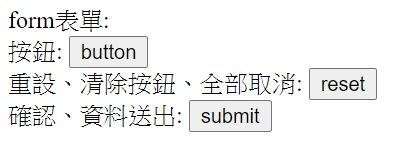
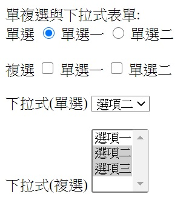

## html
Html：    
```html
<!DOCTYPE html>
<head>
	<meta charset="utf-8">
	<title>parctice</title>
</head>
<body>
	<p>嗨</p>
	<p>嗨,這是分段喔</p>

	這裡是換行<br/>
	換行間距比較小喔~

	<pre>
		"pre"會保存原始格式
		會保留tab	或是 空白
		
	</pre>
	我&nbsp要示範空白
	"& nbsp"是空白 記得&和n中間不要有空白
	<ol>
		<li>有順序項目符號一</li>
		<li>有順序項目符號二</li>
	</ol>
	<ul>
		<li>無順序項目符號一</li>
		<li>無順序項目符號二</li>
	</ul>
<body/>
```
顯示：
<p>嗨</p>
<p>嗨,這是分段喔</p>

這裡是換行<br/>
換行間距比較小喔~
<pre>
	"pre"會保存原始格式
	會保留tab	或是 空白	
</pre>
我&nbsp要示範空白
"& nbsp"是空白 記得&和n中間不要有空白
<ol>
	<li>有順序項目符號一</li>
	<li>有順序項目符號二</li>
</ol>
<ul>
	<li>無順序項目符號一</li>
	<li>無順序項目符號二</li>
</ul>

<hr>

dl dt dd:
dl 不會特別呈現出效果，但在頁面上會宣告一個清單空間，讓每個項目能夠在空間中完整呈現
dt 和 dd 是一組一組的搭配，其中項目符號預設會自動產生縮排的效果

```html
<strong>dl標籤不可以與 HTML table 標籤混為一談。</strong>
<dl>
　<dt>項目標題一</dt>
　<dd>這裡是項目敘述一 ...</dd>
　<dt>項目標題二</dt>
　<dd>這裡是項目敘述二 ...</dd>
</dl>

a 是超連結:
<a href="https://www.google.com/" target="view_window">google</a>
```
<strong>dl標籤不可以與 HTML table 標籤混為一談。</strong>
<dl>
　<dt>項目標題一</dt>
　<dd>這裡是項目敘述一 ...</dd>
　<dt>項目標題二</dt>
　<dd>這裡是項目敘述二 ...</dd>
</dl>

a 是超連結:
<a href="https://www.google.com/" target="view_window">google</a>

form表單:
```html
	<form method="get" action = "form_01.aspx">
		按鈕: <input id = "button1" type ="button" value = "button"/>
		<br>

		重設、清除按鈕、全部取消: <input id = "Reset1" type = "reset" value = "reset"/>
		<br>

		確認、資料送出: <input id = "Submit1" type = "submit" value = "submit"/>
		<br>
	</form>
```



<hr>

```html
單複選與下拉式表單:
	<form method="get" action = "form_01.aspx">
		<!--checked & selected 表示 預選-->
		單選
		<input id = "Radio1" type = "radio" value="radio1" checked /> 單選一
		<input id = "Radio1" type = "radio" value="radio2"/> 單選二
		<br><br>

		複選
		<input id = "Checkbox1" type = "checkbox" value="checkbox1" selected /> 單選一
		<input id = "Checkbox2" type = "checkbox" value="checkbox2"/> 單選二
		<br><br>

		下拉式(單選)
		<select id = "Select1">
			<option value = "select1">選項一</option>
			<option value = "select2" selected>選項二</option>
		</select>

		<br><br>
		
		下拉式(複選)
		<select id = "Select2" multiple>
			<option value = "select1">選項一</option>
			<option value = "select2" selected>選項二</option>
			<option value = "select3" selected>選項三</option>
		</select>

	</form>
```



<hr>

